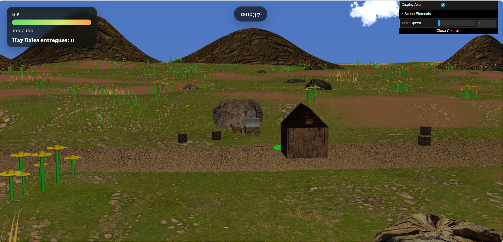
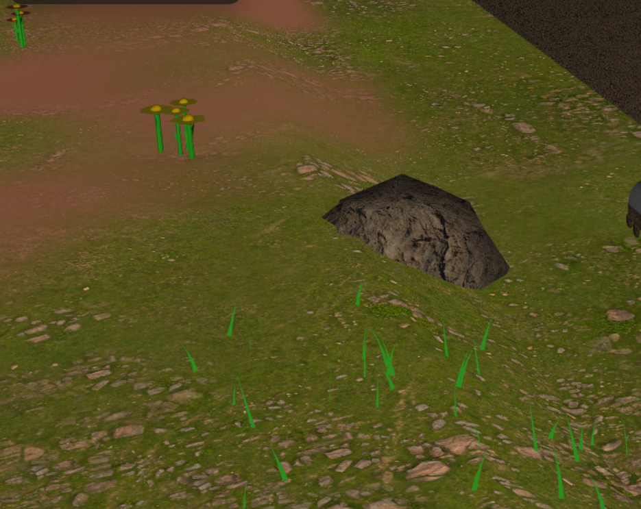
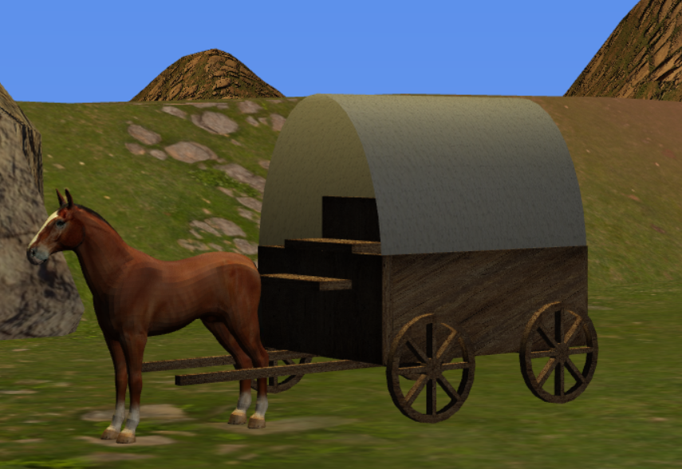
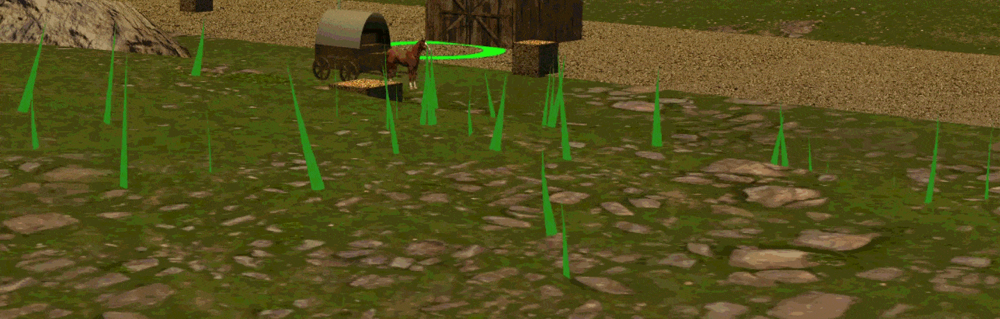
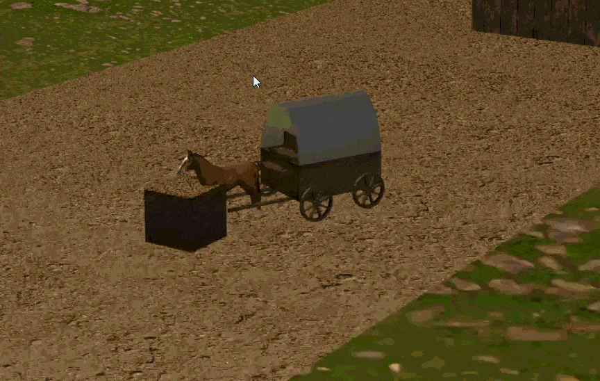

# CG 2025/2026

## Group T11G02

# Projeto CGRA 2025/2026

| Name              | Number    | E-Mail            |
| ----------------- | --------- | ----------------- |
| João Júnior       | 202306719 | up202306719@up.pt |
| Marcelo Lima      | 202305892 | up202305892@up.pt |
| Jennifer Cristina | 202109251 | up202109251@up.pt |

## Descrição do Projeto
Este projeto consiste na implementação de um ambiente rural tridimensional interativo. O jogador controla uma carroça puxada por um cavalo, podendo percorrer o terreno para recolher fardos de feno espalhados pela cena e entregá-los numa zona específica junto ao celeiro.

### Terreno e Ambiente
- Terreno gerado proceduralmente com relevo e pequenas colinas.
- Caminho principal atravessando a cena.
- Rochas distribuídas proceduralmente.
- Flores distribuídas proceduralmente.
- Relva distribuída proceduralmente.
- Cordilheira de montanhas em redor da área jogável.
- Celeiro modelado e texturizado.
- Sistema de céu dinâmico.
- Sol e lua com ciclo dia/noite.
- Camada de nuvens animadas.

### Jogabilidade
- Controlo da carroça através do teclado.
- Sistema de recolha de fardos de feno.
- Sistema de entrega de fardos no celeiro.
- Zona de entrega visual junto ao celeiro.
- Colisões entre a carroça e as pedras.
- Sistema de pontos de vida (HP).
- Transporte simultâneo de até dois fardos.

### Funcionalidades Adicionais
- Shader para animação da relva ao vento.
- Sistema de múltiplas câmaras.
- Câmara de acompanhamento da carroça.
- Câmara de visão afastada ativada através da tecla V.

## Screenshots

### Screenshot 1 – Vista Geral da Cena

### Screenshot 2 – Flores, pedras e detalhe do terreno

### Screenshot 3 – Carroça em detalhe

### Screenshot 4 – Shader animado (GIF)

### Screenshot 5 – Jogabilidade

## Declaração de Utilização de Inteligência Artificial
Durante o desenvolvimento deste projeto foram utilizadas ferramentas de Inteligência Artificial, nomeadamente o ChatGPT,Cloud, Gemini e Copilot como apoio ao processo de aprendizagem e desenvolvimento.

A utilização destas ferramentas incidiu principalmente sobre:

- Esclarecimento de conceitos relacionados com JavaScript, WebGL e CGF;
- Apoio na identificação e correção de erros;
- Sugestões para implementação de funcionalidades;
- Apoio na organização e redação da documentação do projeto.

Todas as decisões de desenvolvimento, integração, testes e validação final das funcionalidades implementadas foram realizadas pelos elementos do grupo.

A utilização destas ferramentas teve um caráter de apoio técnico e pedagógico, não substituindo o trabalho de conceção e implementação.
