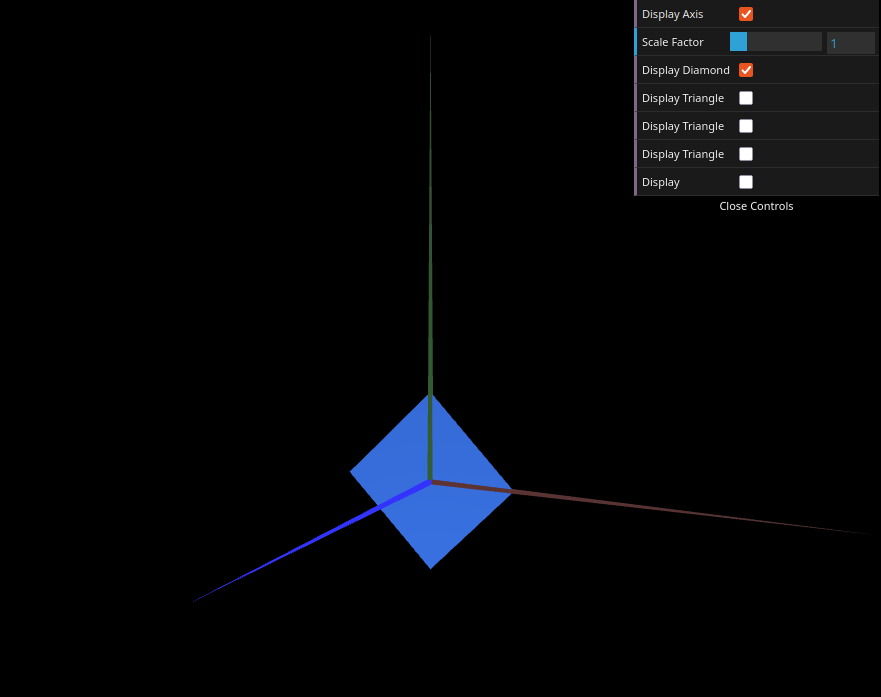
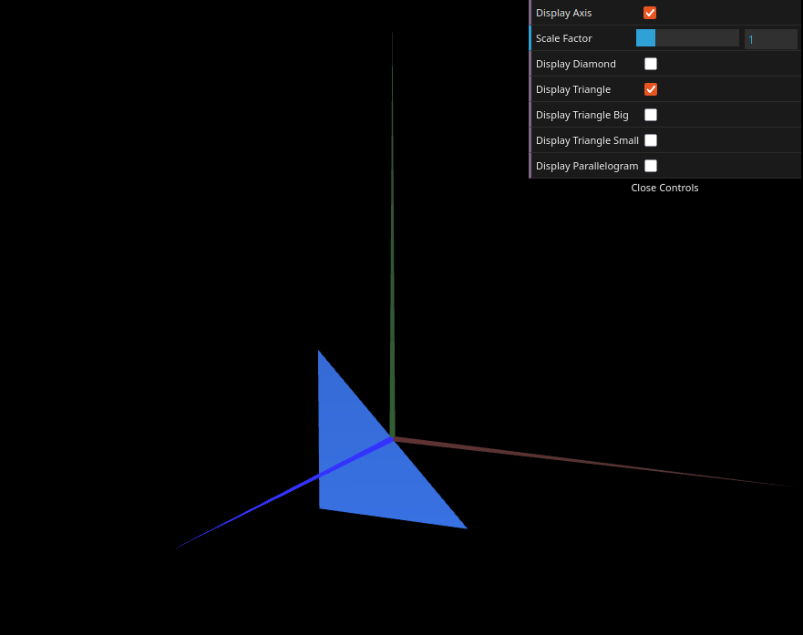
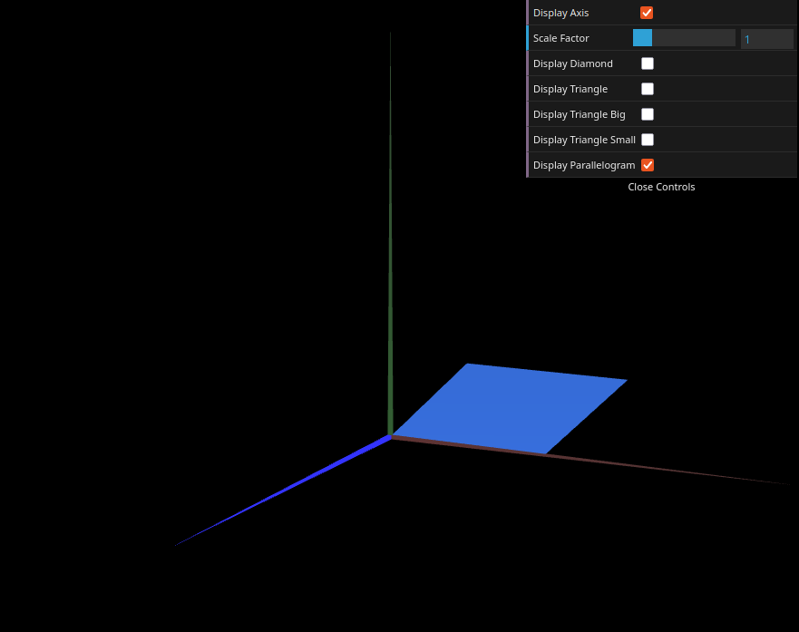
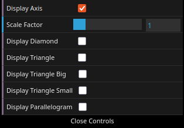
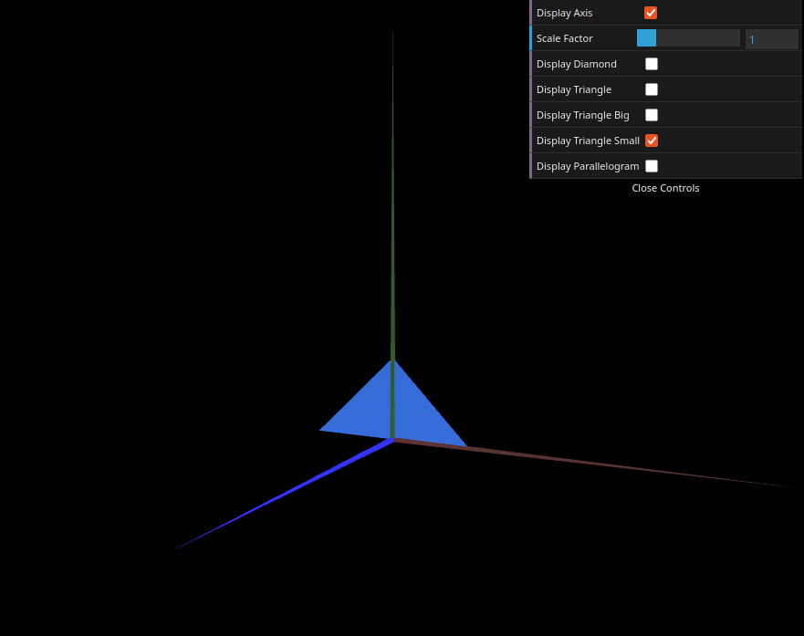
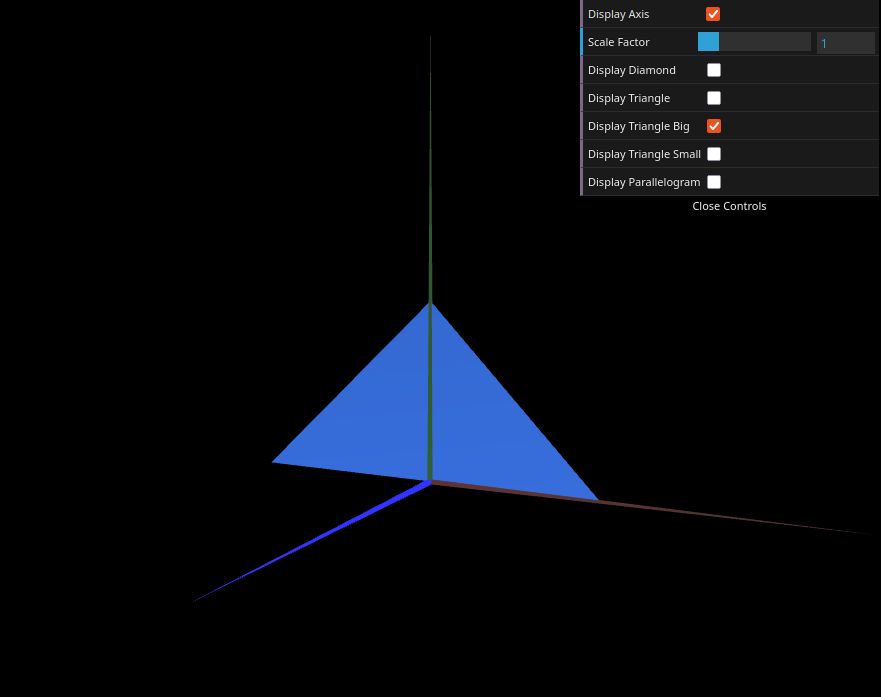

# CG 2025/2026

## Group T11G02

## TP 1 Notes

- In exercise 1, we created `MyTriangle`, a right triangle in the XY plane with sides of 2 units, following the structure of `MyDiamond`. We also created `MyParallelogram`, which required defining vertices carefully to ensure it was double-sided — this was achieved by repeating the indices in reverse order so both faces are rendered.

- In exercise 1, we extended `MyInterface` with checkboxes to toggle the visibility of `MyDiamond`, `MyTriangle`, and `MyParallelogram` independently, using boolean flags in `MyScene`.

- In exercise 2, we created `MyTriangleSmall` and `MyTriangleBig` as additional right triangle primitives with different sizes. The main challenge was correctly positioning the vertices relative to the origin to match the expected shapes shown in the figures.

