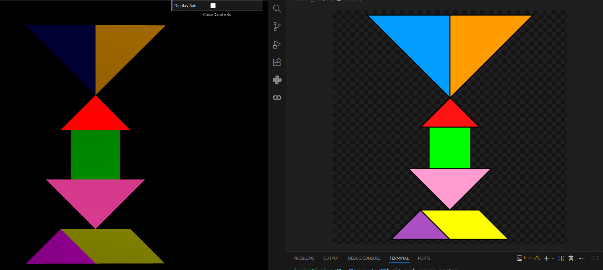
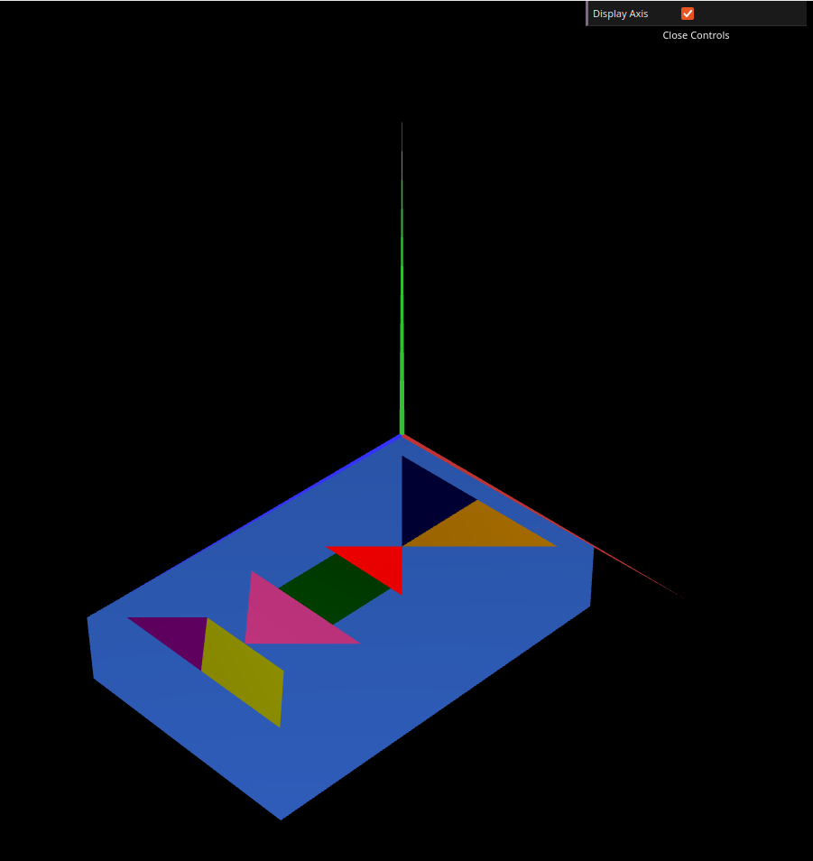
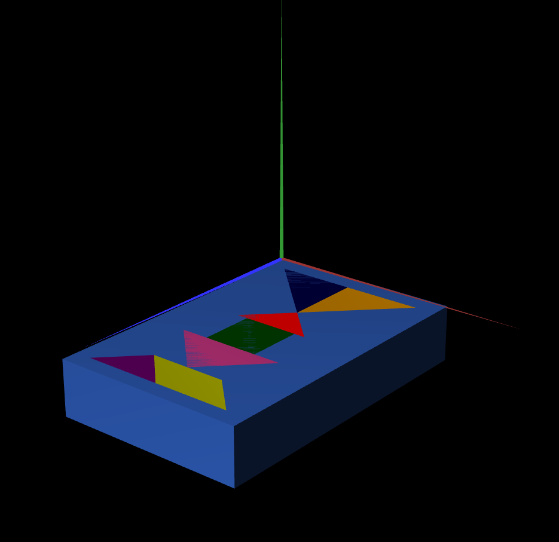

# CG 2025/2026

## Group T11G02

## TP 1 Notes

- In exercise 1, based on the figures created in TP1 class, it was possible to create a single MyTangram.js through 3D graphic transformations. 

- In the other exercise 1, we constructed a unit cube centered at the origin of the reference frame. To do this, we had to indicate the coordinates of the 8 vertices and the 12 triangles that make up the mesh, paying particular attention to ensuring that all the external faces of the cube were visible. 

In this exercise, a new unit cube was developed by reusing planes instead of using an existing primitive. Initially, the class MyQuad was created, representing a centered unit square. Then, the class MyUnitCubeQuad was implemented, composed of an object of the MyQuad class, whose display() function uses geometric transformations — such as translations and rotations — to position the same square in the six necessary orientations, thus forming the faces of the unit cube. Finally, the cube previously used in the scene was replaced with this new implementation, applying the same geometric transformations for comparison and verification of the final result, confirming that the cube was correctly constructed through the composition of planes.

- 

