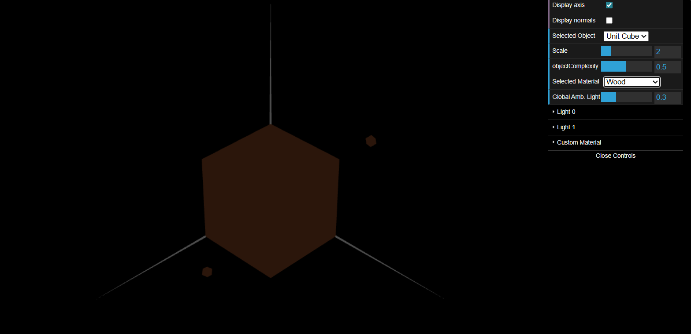
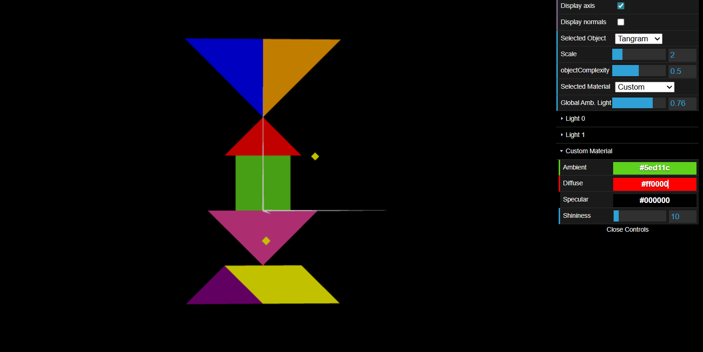
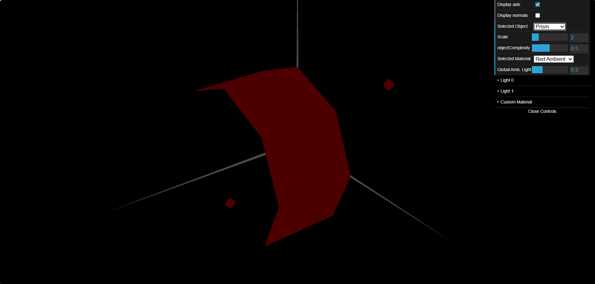
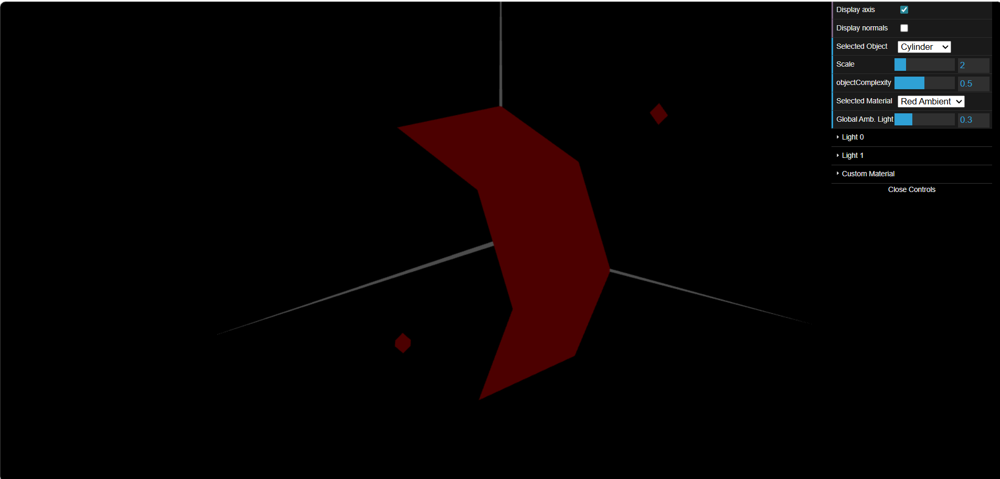

# CG 2025/2026

## Group T11G02

## TP 3 Notes

- In Exercise 1, using the figures created in classes TP1 and TP2, we generated all the necessary normals to ensure that the calculated lighting made sense in relation to the angle of incidence of the light and the viewing angle. We created a material with a wood-like colour and a low specular component.

- Ainda no exercício 1 aplicamos vários materiais com alta componente especular às figuras presentes no tangram.

- In Exercise 2, a prism was constructed with a variable number of sides and varying levels of complexity. 

- In Exercise 3, the normals were placed perpendicular to each edge. This reduced the number of vertices and normals to be calculated.

